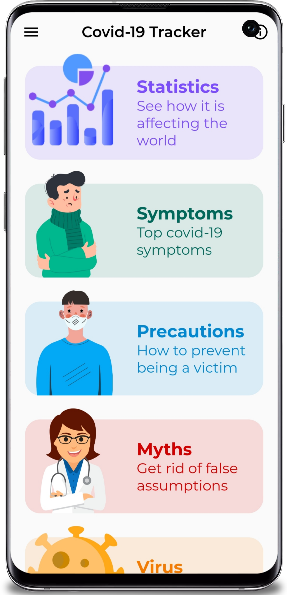
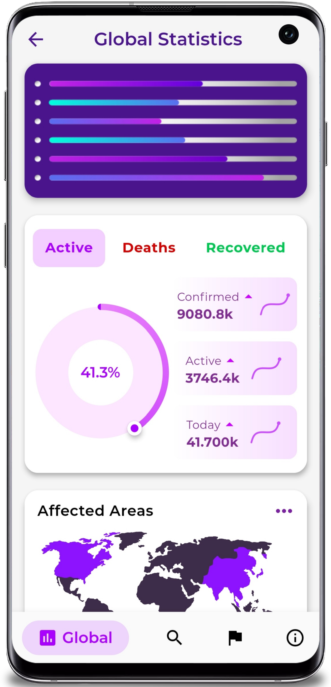
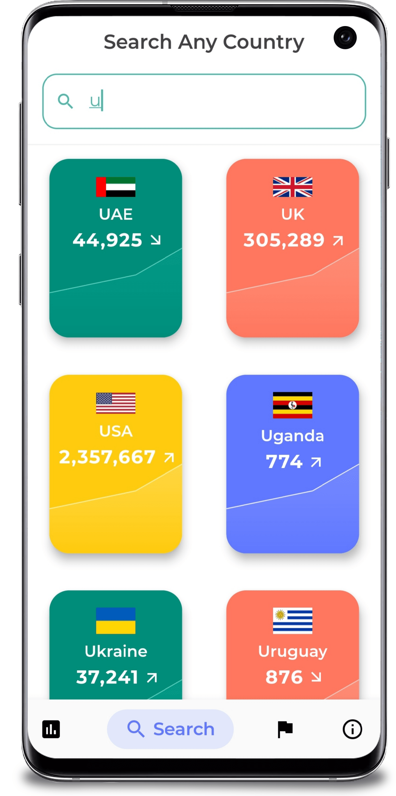
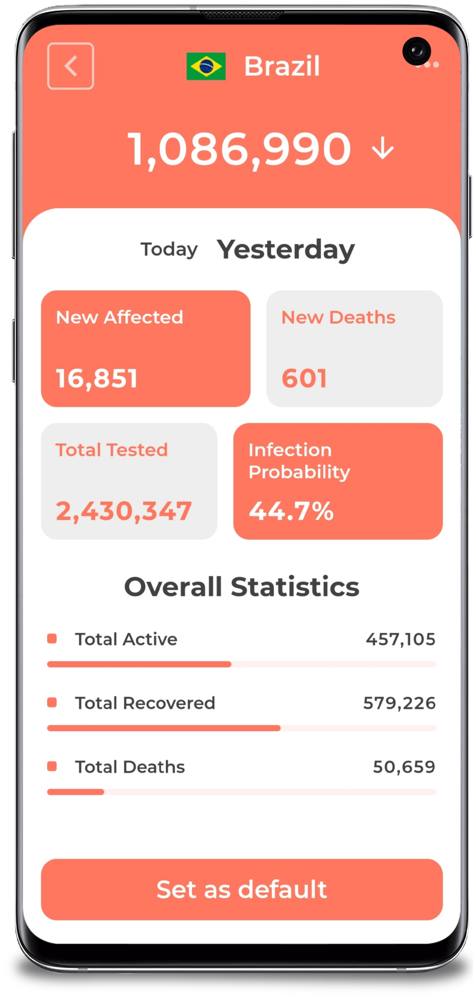
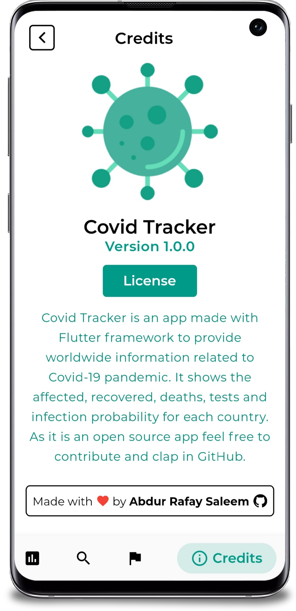
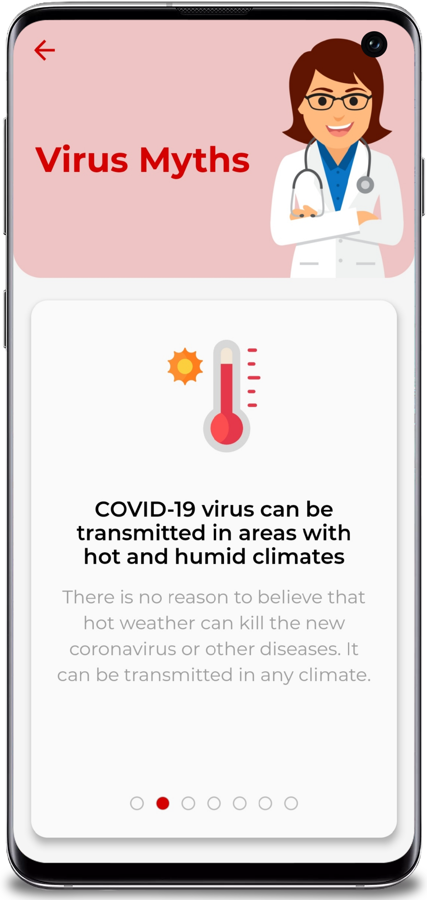

# Covid Tracker - A covid-19 statistics app

        

## Description
Covid Tracker, an Android app built with **Flutter** framework provides global Covid-19 pandemic information to the public, promoting awarness and safety.

API used for data [here](https://corona.lmao.ninja/docs/). **The release apk is available under the release tags. It's also available on this drive link - [Covid Tracker APK](https://drive.google.com/drive/folders/1xazOX_VaaAPzuccusj-hk0zsPZaomDLc?usp=sharing)**

## :iphone: Features

  - Global case count.
  - Case, death and recovery count of each country
  - Total tests and infection probability of each country
  - News updates related to vaccine developement
  - Info, symptoms, precautions and myths of the virus
  - Setting a default country

The UI is inspired by a design on [Dribbble](https://dribbble.com/shots/10847147-Coronavirus-Covid-19-Dashboard) (credits to [Nazirul Hoque](https://dribbble.com/nazirulhoque) on Dribble).

<kbd></kbd>

  

&nbsp;&nbsp;&nbsp;  
&nbsp;  
&nbsp;&nbsp;&nbsp;

## ⭐ Future Features

  - Drawer for easier navigation
  - Onboarding screens
  - Login authentication using Firebase
  - Maps API to detect nearby danger spots

*Feel free to fork and contribute to include these features.* ❤︎

## 🚀 Technologies

  - [Flutter v1.17.4](https://storage.googleapis.com/flutter_infra/releases/stable/windows/flutter_windows_1.17.4-stable.zip)
    - Flutter is an open source framework by Google for building beautiful, natively compiled, multi-platform applications from a single codebase.
  - [Dart v2.8.4](https://dart.dev/get-dart)
    - Dart SDK helps develop Dart web, command-line, and server apps.
  
  ### How to start with Flutter and Dart
  Note: Download the versions mentioned above for Flutter and Dart for the code to work since a different version might cause some issues.
  
  First Download Get and then install FLutter.
  - Dart - [Get Dart](https://dart.dev/get-dart)
  - Flutter - [Get Started](https://docs.flutter.dev/get-started/install)
    
## 🧠 Further Information

Currently, this app is not available for public download on the Android app store. However, if you would like to see how the current features work, we recommend these steps:

1. Download [Android Studio](https://developer.android.com/studio)
2. Clone this repository
3. Use the Android Studio emulator, which has options to view the app on different phones/tablets [Run apps on the android Emulator](https://developer.android.com/studio/run/emulator).

If anyone would like to add other ways of viewing the app in its current state, contributions are always welcome.

As mentioned previously, this application is only available for Android devices. However, we are working to include an IOS version. You can find the working folder for the IOS version under "ios".

## 🤝 Contribute

To contribute, fork the repository and push the changes to the **master** branch. Then submit a pull request for merging with the source. If your code passes the review and checks it will be merged into the master branch.

## 💌 To Do

1. Find new API to draw data from
2. Add future features (can be found above)
3. Insert comments into code for future contributors
4. Create plan to have first version on the Android app store
5. Continue with IOS version

## 💬 Feedback

Feel free to send us feedback on [Twitter](https://twitter.com/gitpointapp) or [file an issue](https://github.com/arafaysaleem/covid_tracker/issues/new). Feature requests are always welcome.

## 📝 License

Licensed under the [MIT License](./LICENSE).
